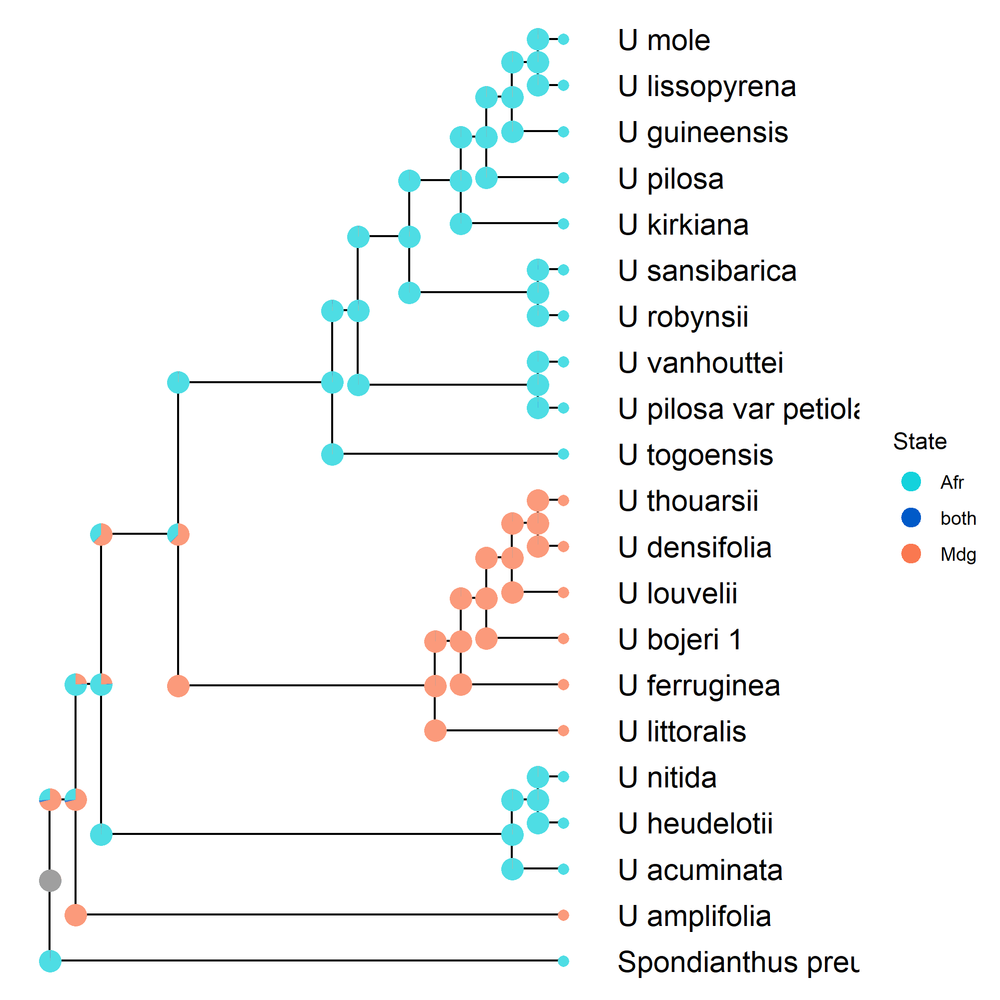
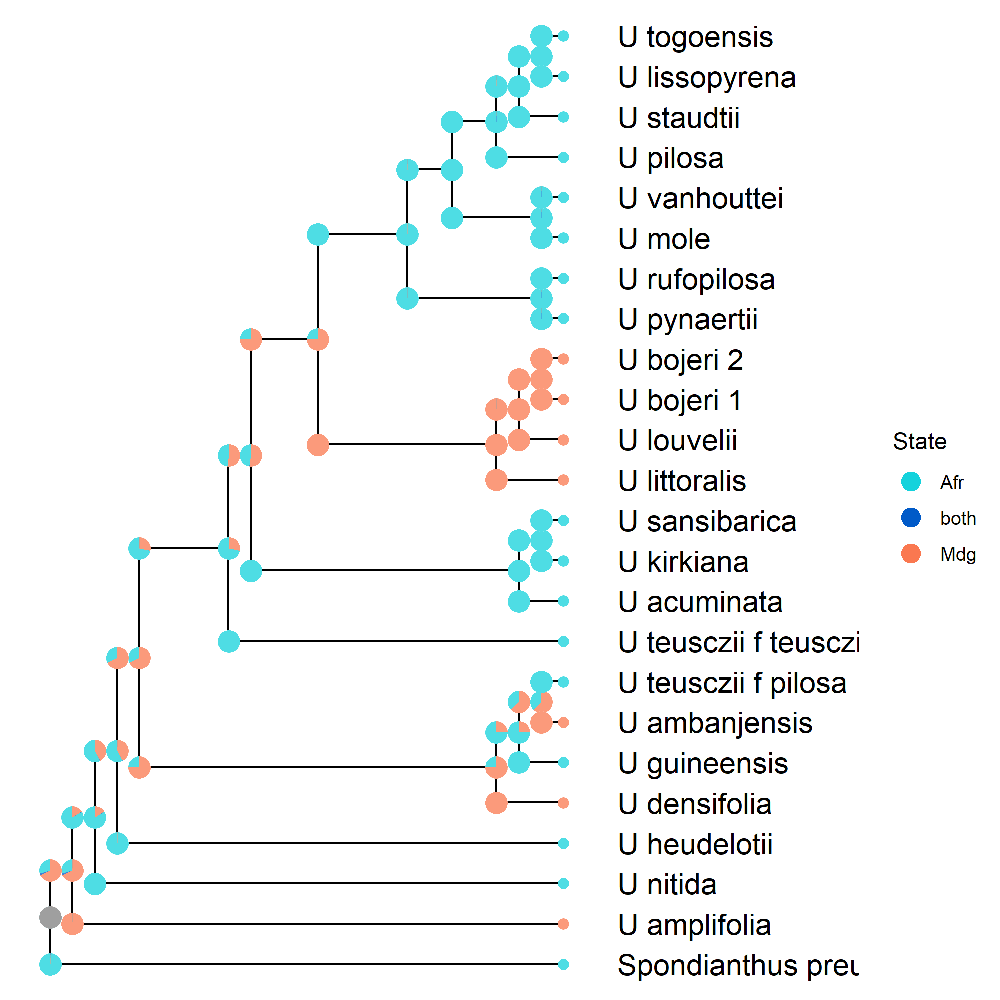

# RevBayes-Uapaca Models

This repository contains the *RevBayes* models used to analyze selected genes from my *Uapaca* angiosperm353 and plastome datasets.


To set up RevBayes see [00_Configure_Project_and_RevBayes.html](https://rawcdn.githack.com/FriedaRosa/RevBayes-DEC-Uapaca/aa4309eb62f3c4882015774bb879518bd8b45e1a/00_Configure_Project_and_RevBayes.html).

The folder is organized into the following subfolders: `data` and `scripts`. `content` holds the RevBayes executable (as downloaded via the 00_Configure_Project_and_RevBayes.qmd).

```{r}
suppressPackageStartupMessages(library(fs))
dir_tree(recurse = FALSE)
```

Where `data` contains the data (input/output) for the RevBayes analyses, including the nuclear tree, plastome tree which were inferred in the phylogenomics pipelines:

1)  **Nuclear**: <https://github.com/FriedaRosa/HybSuite_pipeline_2026>

{width="681"}

```{r}
#| eval: false
suppressPackageStartupMessages(library(ape))
suppressPackageStartupMessages(library(dplyr))

png(filename = "figures/nuclear_tree.png", width = 800, height = 600)
read.tree(
  "data/input/phylogenetic_tree/uapaca_start_ultrametric.tre"
) %>%
  ladderize() %>%
  plot()
dev.off()
```

2)  **Plastome**: <https://github.com/FriedaRosa/Plastome_Phylogenomisc_2026>

    

```{r}
#| eval: false
library(ape)
library(dplyr)

png(filename = "figures/plastome.png")
read.tree(
  "data/input/phylogenetic_tree/uapaca_start_ultrametric_plastome.tre"
) %>%
  ladderize() %>%
  root(outgroup = "Spondianthus_preussii", resolve.root = TRUE) %>%
  plot()
dev.off()
```

3)  it also includes the **Distribution** **Ranges**: `Uapaca_range.nex` which was written by hand with the following format:

```{r}
r <- readLines("./data/input/Uapaca_range.nex")
cat(paste(r, collapse = "\n"))
```

4.  and some high-coverage **molecular sequence** data to estimate the rate of sequence evolution for molecular clock models

```{r}
fs::dir_tree(
  "data/input/molecular_data/",
  regexp = "(?:uapaca|plastome).*\\.nex$"
)
```


# Analyses in this repository:

## A. DEC vs. DEC+J+F analysis
This repository contains the *RevBayes* scripts used to perform the Dispersal-Extinction-Cladogenesis (DEC) analyses (and in addition one that includes jump dispersal and full sympatry)

### The resulting ancestral range reconstruction on the nuclear tree (DEC):


### The resulting ancestral range reconstruction on the nuclear tree (DEC+J+F):


### The resulting ancestral range reconstruction on the plastome tree (DEC):


### The resulting ancestral range reconstruction on the plastome tree (DEC+J+F):


## B. Molecular clock model selection
That part is based on the following tutorial: https://revbayes.github.io/tutorials/clocks/


