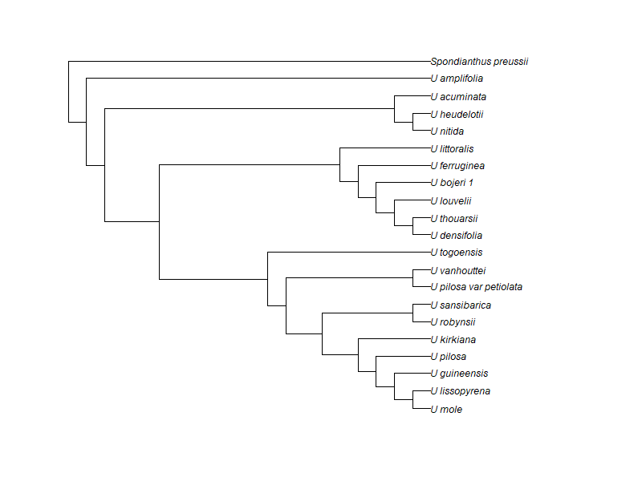
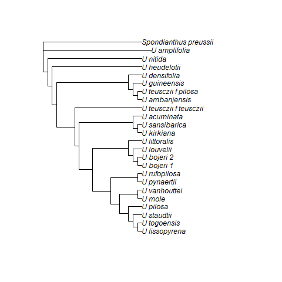
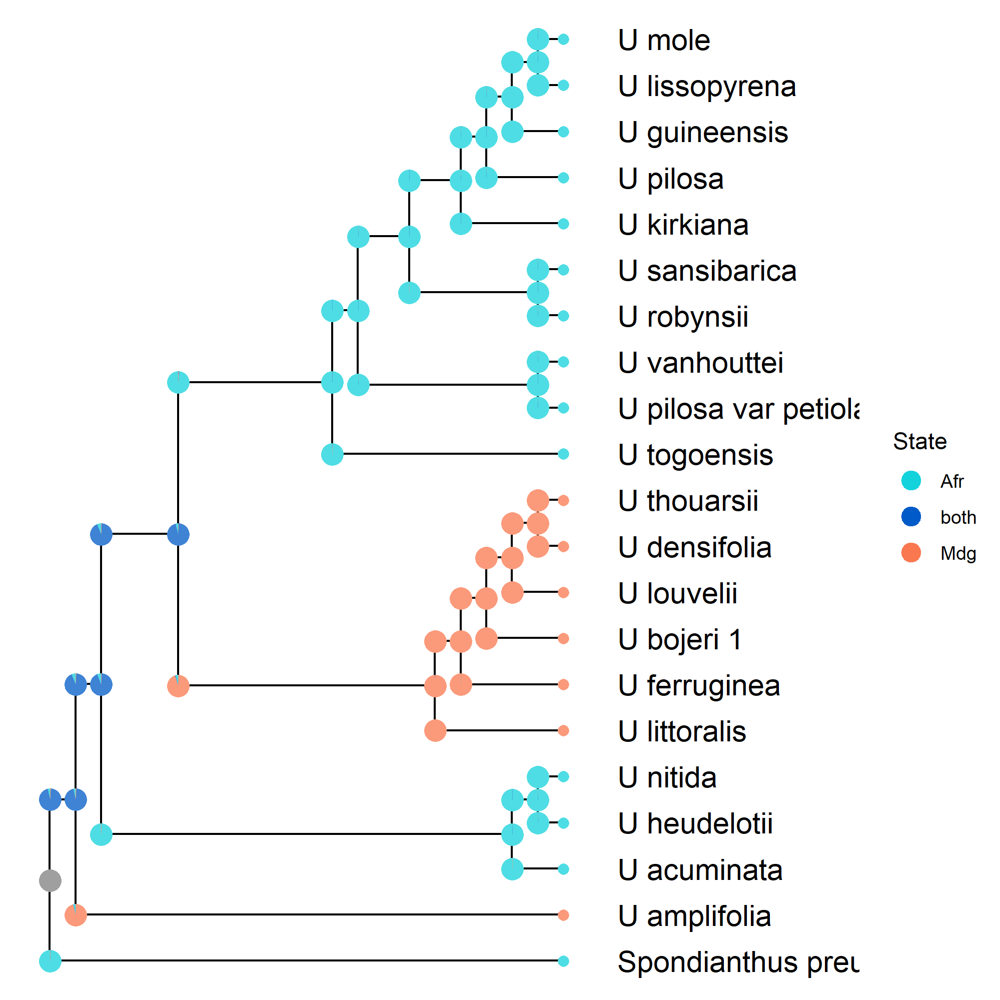
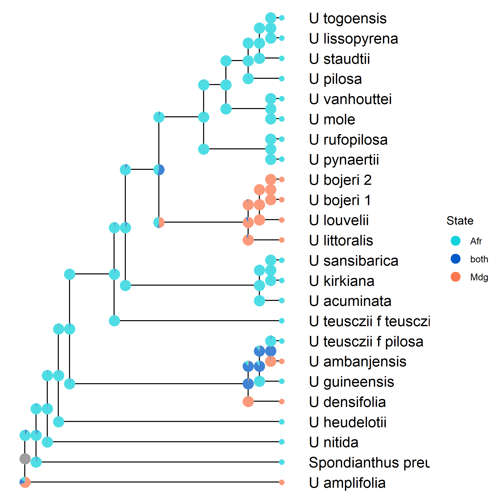
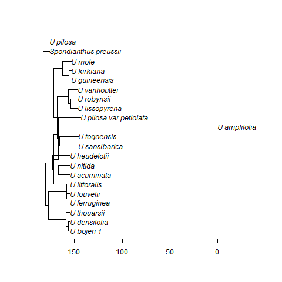
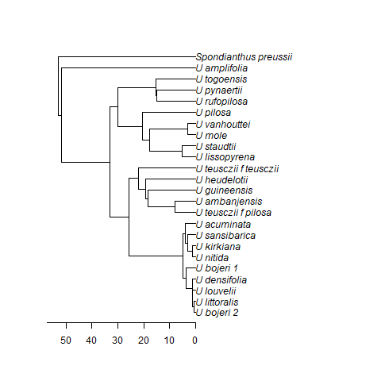
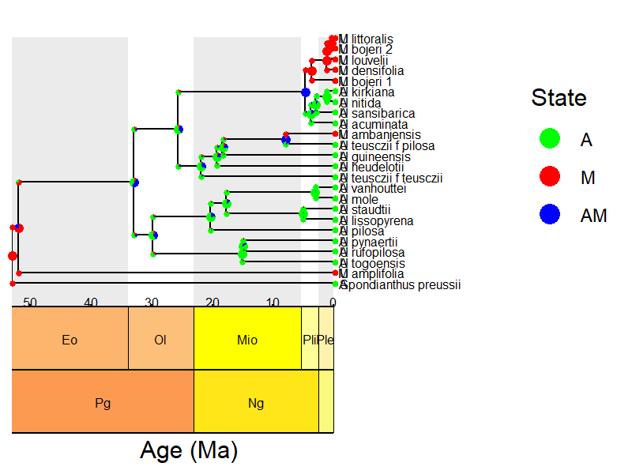

# RevBayes-Uapaca Models

This repository contains the [RevBayes]{.smallcaps} models used to analyze selected nuclear genes from my *Uapaca* angiosperm353 (ref 1) and plastome datasets that were generated by Jan Hackel in 2021 at Kew Gardens, UK.

I inferred phylogenetic trees via available hyb-seq pipelines. Specifically, the nuclear ML tree was inferred from gene trees under a multispecies coalescent framework with the new [HybSuite]{.smallcaps} toolbox (ref 2) and the *wASTRAL* model. The plastome tree was inferred from concatenated chloroplast genome sequences and [IQTree2]{.smallcaps}. See pipeline repositories for details.

1)  Nuclear Tree Inference <https://github.com/FriedaRosa/HybSuite_pipeline_2026>

2)  Plastome Tree inference <https://github.com/FriedaRosa/Plastome_Phylogenomisc_2026>.

## Project background

The project is about inferring the evolutionary history and historical biome associations of the African-Malagasy tree genus *Uapaca* (Phyllanthaceae). Using target-capture phylogenomic data (ref 1) combined with genome skimming-derived plastome data (hyb-seq, ref 3), I perform bayesian tree inference (in addition to maximum likelihood methods), molecular and fossil-calibrated dating and divergence time estimation, ancestral area and ancestral biome reconstruction to investigate how lineages were able to colonize two ends of a truly extreme gradient of environmental conditions - namely dry, fire-disturbed savanna and wet (sometimes riverene, mangrove) rain forests, and high altitude cloud forests.

Besides investigating the economically, culturally, medically, and ecologically important genus *Uapaca* and it's evolutionary origins, I use this spectacular clade as means to investigate pathways, timings, and hypotheses regarding colonization and biome evolution in Madagascar more generally:

*Uapaca bojeri* is the mono-dominant species in the floristically diverse, endangered (ref 4; risk criterion A3), endemic Tapia biome where it forms fire-adapted savanna patches in association with grasses, ericoid shrubs and host-specific fungi that are endemic to Tapia as well and only co-occur with *Uapaca bojeri*.

------------------------------------------------------------------------

This project is part of my PhD in Plant Systematics at the Department of Ecology, Environment and Plant Sciences at Stockholm University where I am supervised by Jan Hackel, Catarina Rydin and Sylvain Razafimandimbison. I work in collaboration with the Naturhistoriska Riksmuseet (Natural history museum) in Stockholm and their Botany (BOT) and Genomics and Bioinformatics (KÖL) departments where I use their laboratory facilties and the herbarium (S).

Unfortunately, generation of molecular sequence data from *Uapaca* individuals is often aggravated by their large amounts of phenolic compounds that interfere during DNA extraction. In addtion, we rely on historical collections of dried museum material available across herbaria in Europe. These materials were often collected during colonial times by french, belgian, british, dutch, or german colonists - in non-ethical ways and without metadata that describe where exactly the material came from... and often misidentified on species-level. This - and the fact that most material is quite old and degraded - makes associating environmental conditions to sequence data even harder.

Due to these circumstances, the molecular data that I currently (as of June 2026) use in this project are mostly of poor quality and inferred trees are currently not to be trusted.

Because of this, one of the first objectives of this project is to work together with local botanists from Africa and Madagascar in addition to experts from Europe to increase the resolution of information about *Uapaca*. This includes field trips to Madagascar to collect fresh plant material for additional DNA extractions and sequencing. The first trip is planned for July-August 2026 to the central highlands and the eastern rain forest (funded through *CF Liljevalch:s* and *Albert and Maria Bergström foundation*). The second trip is planned for spring 2027 to the northwest of Madagascar. These two trips should cover most of the Malagasy diversity and enable me to reconstruct the evolution of this intriguing clade in Madagascar with increased resolution and certainty.

## Data description

### 1. Nuclear sequences (analyses indexed here with: \*\_nuc\*):

-   folder: `molecular_data`

    includes a selection of 9 nuclear loci from the set of 353 targeted sequences that seem to be of reasonable quality and resolution across nucleotide sites and taxa. The files labeled `uapaca_gene_*.nex` are derived from [MAFFT]{.smallcaps}-aligned `.fasta` files, converted to `.nex` format for analysis with [RevBayes]{.smallcaps}.

    > *!!* Note that this selection of loci is just a temporary placeholder since I am currently still generating additional sequences for the whole subfamily *Antidesmatoidea* (Phyllanthaceae) and multiple replicates per *Uapaca* species since some of the material has been misidentified and or only identified to genus-level.

-   folder: `phylogenetic_tree`

    includes two phylogenetic trees, both based on the complete (but trimmed for high-quality) set of 353 nuclear target loci.

    -   `wASTRAL_HybSuite_HRS.rr.tre` is the raw result of the [HybSuite]{.smallcaps} pipeline - re-rooted and assembled through [HybPiper]{.smallcaps}. The tree is not ultrametric.
    -   `uapaca_start_ultrametric.tre` is a modified version of the first tree but made ultrametric to enable [RevBayes]{.smallcaps} analyses. This tree is used as starting tree for stochastic topology inference in some of the analyses in this repository (thus the prefix `_start_`). [RevBayes]{.smallcaps} requires ultrametric trees so I made it ultrametric in [R]{.smallcaps}. (placeholder until higher-quality sequences are available for more careful analysis)

    > Again, this is just a placeholder until higher-quality data is available from my laboratory work.

```{r}
#| eval: false
library(ape)
library(dplyr)

png(filename = "figures/nuclear_tree.png", width = 800, height = 600)
read.tree(
  "data/input/phylogenetic_tree/uapaca_start_ultrametric.tre"
) %>%
  ladderize() %>%
  plot()
dev.off()
```

{width="681"}

### 2. Plastome sequences (analyses indexed here with: \*\_plstm\*):

-   folder: `molecular_data`

    includes the concatenated plastome alignments (`plastome_concat.nex`) untrimmed and not specifically selected but visually checked for false and low quality alignments.

-   folder: `phylogenetic_tree`

    includes two phylogenetic trees, both based on the concatenated sequence alignment from the `molecular_data` folder.

    -   `plastome.fasta.concat.treefile` is the original output from [IQTree2]{.smallcaps} inference. It is not rooted and not ultrametric.
    -   `uapaca_start_ultrametric_plastome.tre` is the plastome-equivalent of the ultrametric nuclear tree from before.

```{r}
#| eval: false
library(ape)
library(dplyr)

png(filename = "figures/plastome.png", width = 800, height = 600)
read.tree(
  "data/input/phylogenetic_tree/uapaca_start_ultrametric_plastome.tre"
) %>%
  ladderize() %>%
  root(outgroup = "Spondianthus_preussii", resolve.root = TRUE) %>%
  plot()
dev.off()
```

{width="681"}

### 3. Biogeographic data

-   range data:\
    These are `.nexus` files for the species that are represented in the two phylogenies (`nuc`, `plstm` - they do not have the same species due to quality differences in nuclear and plastome data). These files have information on the geographical Distributions. `Uapaca_range.nex` and `Uapaca_range_plastome.nex`. Both were written by hand following the [RevBayes]{.smallcaps} requirements. They look like this:

1.  nuclear

```{r}
#| warning: false
#| message: false
r <- readLines("./data/input/Uapaca_range.nex")
cat(paste(r, collapse = "\n"))
    
```

2.  plastome

```{r}
#| warning: false
#| message: false
r2 <- readLines("./data/input/Uapaca_range_plastome.nex")
cat(paste(r2, collapse = "\n"))
  
```

### 4. Paleobiogeographic data

-   Feature-informed biogeographic models (FIG) require paleobiogeographic information about the regions that are being assessed for influence on the tree topology. They are found in the `output/paleo/` folder. I estimated these data using the PALEOMap database that includes paleo histories of coastlines that take into account sea-level changes through time in addition to plate movements. Area size (km\^2) and Distance between areas (km) and additional categorical features about africa and Madgascar were complied using the following script:\
    `reports/00_Paleobiogeographic_features.qmd`

    > rendered report can be seen here:\
    > [https://rawcdn.githack.com/FriedaRosa/RevBayes-DEC-Uapaca/0a58ed5696ab721eb23c895a4e73ee07b0a699ba/reports/00_Paleobiogeographic_features.html](#0)

------------------------------------------------------------------------

## Repository structure

To set up [RevBayes]{.smallcaps} see [00_Configure_Project_and_RevBayes.html](https://rawcdn.githack.com/FriedaRosa/RevBayes-DEC-Uapaca/aa4309eb62f3c4882015774bb879518bd8b45e1a/00_Configure_Project_and_RevBayes.html).

The folder is organized into the following subfolders: `data`, `scripts`, `figures` and `reports`. Additionally, `content` holds the [RevBayes]{.smallcaps} executable (as downloaded via the 00_Configure_Project_and_RevBayes.qmd).

```{r}
suppressPackageStartupMessages(library(fs))
dir_tree(recurse = FALSE)
```

`reports` has rendered and commented scripts and workflows that connect multiple scripts for single analyses. I recommend checking the reports before trying to make your way through the jungle of scripts.

`data` contains the data (`input`/`output`) for the [RevBayes]{.smallcaps} analyses, including the molecular data, phylogenetic trees and ranges information.

------------------------------------------------------------------------

## Analyses in this repository:

### A. DEC vs. DEC+F vs. DEC+J+F analysis

This repository contains the scripts used to perform the `Dispersal-Extinction-Cladogenesis (DEC)` analyses (and in addition one that includes jump dispersal and full sympatry). I used comparison of BayesFactors to determine which model is supported and the results showed that the simple `DEC` model was preferred over `DEC+J` and `DEC+J+F`. The final result that was computed using `mcmc` is the following tree:

{width="639"}

{width="650"}

### B. Molecular clock model selection

That part is based on the following tutorial: https://revbayes.github.io/tutorials/clocks/.

I compare a global clock model with a UCLN clock model. The BayesFactor comparison revealed the UCLN model to be a better fit. The resulting tree looks like this: (not really good honestly!!!!) I have to continue to adjust the priors to this model. The age range is waaaaay too old and the relationships are not well resolved. This was based on the subset of 9 nuclear loci.

{width="648"}

### C. Molecular clock (global) on the whole plastome alignment

No model comparison was done here because the `mcmc` for this model ran about 20 hours. The results look better than the results for the UCLN nuclear data.

{width="694"}

### D. Feature-dependent diversification models

1_molecular_phylogenetics (uncalibrated divergence times) I estimated the divergence times from the molecular data to get familiar with the methods.

2_GeoSSE (geographically informed diversification model) I used the plastome sequences for this - again just to get familiar with the methods.

3_timefig (Time-heterogeneous biogeographic diversification model)

{width="709"}

### References

\[1\] Johnson, Matthew G., et al. "A universal probe set for targeted sequencing of 353 nuclear genes from any flowering plant designed using k-medoids clustering." Systematic biology 68.4 (2019): 594-606.

\[2\] Liu, Yu‐Xuan, et al. "HybSuite: An integrated pipeline for hybrid capture phylogenomics from reads to trees." Applications in Plant Sciences (2026): e70059.

\[3\] Weitemier, K., Straub, S.C.K., Cronn, R.C., Fishbein, M., Schmickl, R., McDonnell, A. and Liston, A. (2014), Hyb-Seq: Combining target enrichment and genome skimming for plant phylogenomics. Applications in Plant Sciences, 2: 1400042. https://doi.org/10.3732/apps.1400042

\[4\] Keith, D.A., Rodríguez, J.P., Rodríguez-Clark, K.M., Nicholson, E., Aapala, K., Alonso, A., Asmussen, M., Bachman, S., Basset, A., Barrow, E.G., Benson, J.S., Bishop, M.J., Bonifacio, R., Brooks, T.M., Burgman, M.A., Comer, P., Comín, F.A., Essl, F., Faber-Langendoen, D., Fairweather, P.G., Holdaway, R.J., Jennings, M., Kingsford, R.T., Lester, R.E., Nally, R. Mac, McCarthy, M.A., Moat, J., Oliveira-Miranda, M.A., Pisanu, P., Poulin, B., Regan, T.J., Riecken, U., Spalding, M.D., Zambrano-Martínez, S., 2013. Scientific Foundations for an IUCN Red List of Ecosystems.en. PLoS One 8. https://doi.org/10.1371/journal.pone.0062111